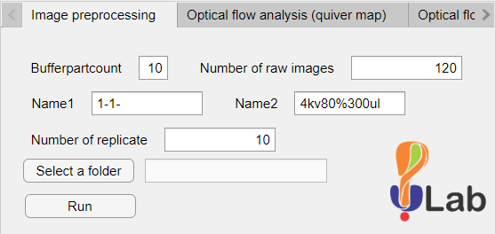

# Schlieren Vapor Flow Image Analysis Toolkit

MATLAB App Designer toolkit for analyzing schlieren videos of vapor or gas-flow shadows and estimating flow velocity from recorded image sequences.

This repository packages the app that was used in the study _High-Speed Schlieren Imaging of Vapor Formation in Electrospray Plume_ and exposes the source in a GitHub-friendly layout.

## What the app does

The app is organized into three analysis workflows:

1. `Image preprocessing`
   Converts raw stacked BMP captures into cropped JPG frames and assembles replicate AVI videos.
2. `Optical flow analysis`
   Uses MATLAB's Farneback optical flow implementation to estimate mean vapor velocity and generate quiver-map or heatmap overlays.
3. `Flow pattern characterization`
   Classifies selected regions of the video as laminar or turbulent based on frame-wise intensity variation and reports the turbulent time ratio.

## Repository layout

- `src/schlieren_app.mlapp`: original MATLAB App Designer project
- `src/schlieren_app.m`: extracted readable MATLAB class source
- `dist/Image analysis toolkit.mlappinstall`: installable MATLAB app package
- `docs/assets/app-ui.png`: UI screenshot recovered from the installer package

## Expected MATLAB requirements

Based on the code, this app was created in `MATLAB R2021a` and appears to rely on:

- MATLAB App Designer
- Image Processing Toolbox
- Computer Vision Toolbox
- Signal Processing Toolbox

You may also need write access to the selected data folders because the app exports processed images, videos, Excel tables, and diagnostic plots.

## Typical workflow

1. Install the app from `dist/Image analysis toolkit.mlappinstall`, or open `src/schlieren_app.mlapp` in App Designer.
2. Use the preprocessing tab to split raw stacked image buffers into frame images and build per-replicate videos.
3. Run optical-flow analysis on the generated videos.
4. Draw the calibration circle when prompted so the app can convert pixels to centimeters.
5. Export the mean velocity results and, if needed, the overlay videos and averaged heatmap.
6. Run flow-pattern characterization on a selected video and draw the region of interest for laminar/turbulent classification.

## Notes

- The original local workspace contained the MATLAB installer rather than a conventional source tree, so this repository was reconstructed from the `.mlappinstall` package.
- The supporting article PDF from ACS is not redistributed here. Use the DOI link below for the publication record.
- File paths in the current app implementation use Windows-style separators.

## Citation

If you use this app or its analysis workflow in academic work, please cite:

Li, H.-I.; Prabhu, G. R. D.; Buchowiecki, K.; Urban, P. L. High-Speed Schlieren Imaging of Vapor Formation in Electrospray Plume. _Journal of the American Society for Mass Spectrometry_ **2024**, _35_ (2), 244-254. https://doi.org/10.1021/jasms.3c00345
